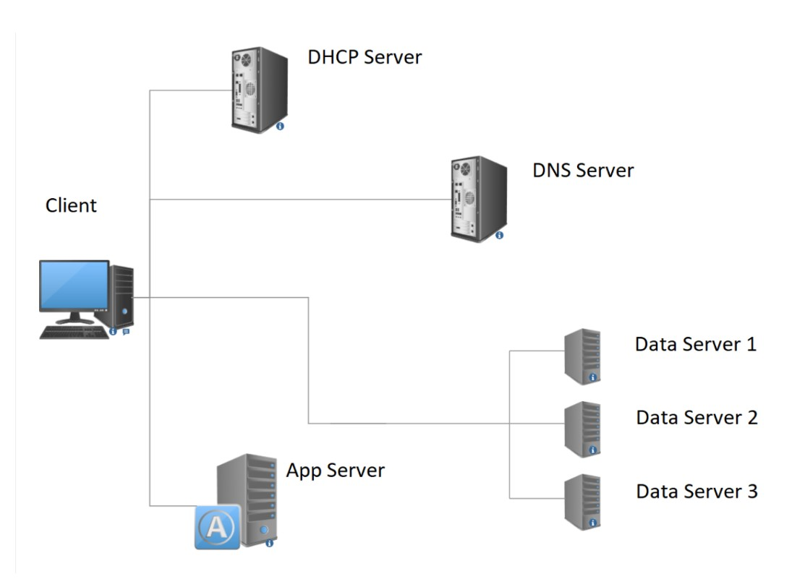

# Communication Networks - Final Project

Custom Reliable User Datagram Protocol (RUDP).
A detailed report in Hebrew is included in the repository, containing screenshots of the system's operation and results.
link to the report: [Hebrew Report](README.pdf)

## System Description

The system comprises six servers: DHCP, DNS, APPLICATION SERVER, and three information servers. Once the servers are operational, any client connecting to the network can:

1. Obtain an IP address from the DHCP SERVER.
2. Retrieve the APP SERVER's address from the DNS SERVER.
3. Request a cat picture from the APPLICATION SERVER, which then directs the client to one of three local servers. Each server hosts a different cat image for download.

Communication between the client, information servers, and the application can be based on either the TCP protocol or our custom RUDP protocol. The RUDP, a protocol built on UDP, introduces new features that we will detail further.

## Software Activation and Flow Chart

To activate the system, perform a GIT CLONE of the project from [this repository](https://github.com/aradbm/Networks_Final_Project-RUDP). The project includes three folders, each representing a different system configuration:

- System based on RUDP protocol for the application and TCP for local servers.
- System based on TCP protocol with local servers.
- System based on TCP protocol with servers on the Internet.

Select the desired system folder, open a terminal in that folder's location, and execute the following files (e.g., for `DNS.py`, run `python3 DNS.py`):

- `DHCP.py`
- `DNS.py`
- `app_server.py`
- `multi_server.py` (not needed if the system addresses servers on the Internet).

If the system does not target Internet servers, it is advisable to disable your Internet connection before running.

## Dependencies

- Python 3.10
- Python libraries: Scapy, Pillow, BytesIO
- Windows 10 (Note: Sniffing interfaces may vary across operating systems).

## Attachments

Included in the repository are three folders, each representing a different system configuration:

- A folder with server and client runtime files based on the TCP protocol, wherein the application server refers to local servers.
- A folder with runtime files for server and client based on the RUDP protocol, enabling information transfer with our custom RUDP protocol. This includes 5 test files, each with an explanation of its purpose.
- A folder containing runtime files for server and client based on the TCP protocol, wherein the application server refers to external servers on the Internet.
